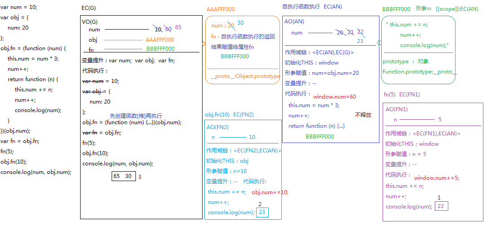
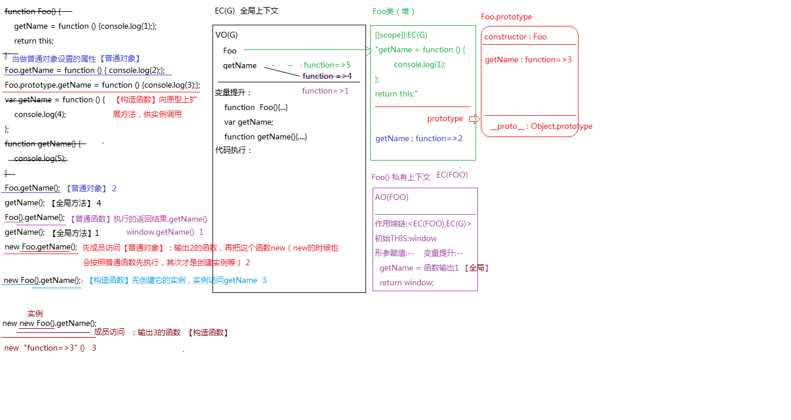

## call原理
```js
function fn1(){console.log(1);}
function fn2(){console.log(2);}
fn1.call(fn2);
fn1.call.call(fn2);
Function.prototype.call(fn1);
Function.prototype.call.call(fn1);
```
> 首先回顾call的核心源码
```js
Function.prototype.call=function call(context,...params){
    //call核心源码
    let key=Symbol('key');
    let result;
    context[key]=this;
    result=context[key](...params)
    delete context[key]
    return result
}
```
1. `fn1.call(fn2)` 函数fn1是Function的实例，可通过原型链查找到Fucntion原型上的call方法，将call方法执行，call中的`this是fn1`，`context=>fn2`,`fn2.xx=fn1`,`fn2.xx()`执行，执行的是fn1，让fn1中的this变为fn2 输出结果1
2. `fn1.call.call(fn2)` `fn1.call`是call函数，call函数执行call方法，call方法中this是call函数，context是fn2，`fn2.xx=call函数` ,`fn2.xx()`,让call函数执行，call函数中的this变为fn2，`this=fn2`，没有传参数context是window，`window.xx=fn2`，`window.xx()`,把fn2执行，让fn2中的this指向window，fn2执行输出2
3. `Function.prototype.call(fn1)` `this->Function.prototype(匿名空函数)`，`context->fn1`,`fn1.xx=匿名空函数`，`fn1.xx()`,把匿名空函数执行，让匿名空函数中的this为fn1，匿名空函数执行什么也不输出
4. `Function.prototype.call`是call函数，call方法中的this是call函数，context是fn1，`fn1.xx=call函数`，`fn1.xx()`执行就是call函数执行，并将call函数中的this变为fn1，`this->fn1`,`context->window`,`window.xx=fn1`,`window.xx()`就是fn1执行，fn1中this变为window
## 变量提升、this
```js
var num = 10;
var obj = {
    num: 20
};
obj.fn = (function (num) {
    this.num = num * 3;
    num++;
    return function (n) {
        this.num += n;
        num++;
        console.log(num);
    }
})(obj.num);
var fn = obj.fn;
fn(5);
obj.fn(10);
console.log(num, obj.num);
//22
//23
//65 30
```

1. 在全局执行上下文中`EC(G)`,在代码执行之前，首先对带`var`、`function`的进行变量提升，生成全局变量对象`VO(G)`,`num`,`obj`,`fun`,
2. 全局代码执行，变量提升过的不用重新创建，直接赋值，10赋给全局的num，对象`{num：20}`会开辟一个堆`(AAAFFF000)`，赋给obj
3. 自执行函数执行，先创建堆再执行,执行的返回结果赋值给`obj.fn`函数执行形成私有作用域`EC(AN)`,私有变量对象`AO(AN)`,代码执行之前初始化作用域链`<EC(AN),EC(G)>`,初始化`this：window`，形参赋值`num=obj.num=20`,这里没有变量提升
4. `EC(AN)`中代码执行，`this是window`，所以`VO(G)`中`num=20*3=60`，`AO(AN)`中`num=21`，返回结果是一个函数，所以开辟一个新的堆地址`(BBBFFF000)`，将地址赋给`obj.fn`，因为是在自执行函数中开辟的所以`(BBBFFF000)`作用域在`EC(AN)`
5. 代码继续执行`fn`也指向`(BBBFFF000)`,`fn(5)`执行，形成私有作用域`AO(FN1)`,同样初始化作用域链`<EC(FN1),EC(AN)>`,初始化`this：window`，形参赋值`n=5`，没有变量提升，，代码执行`VO(G)`中`num=65`，由于当前作用域中没有`num`向上查找`AO(AN)`中`num=22`，此时输出`22`
6. `obj.fn(10)`执行形成私有作用域`EC(FN2)`和私有变量对象`AO(FN2)`，同样初始化作用域链`<EC(FN2),EC(AN)>`,初始化`this：obj`形参赋值`n=10`，没有变量提升，代码执行`obj.num+=10,obj.num=30`,由于当前作用域中没有`num`向上查找`AO(AN)`中`num=23，输出23`
7. 最后输出`num=65，obj.num=30`
## 数据类型转换
> 加号在JS中不一定是数学运算，只要有一边出现字符串（或者对象【因为 数字+对象，理论上是把对象转换为数字进行运算，但是我们知道，对象转换为数字要先转换为字符串，这样在还没有转换为数字的时候，就遇到字符串了，变为字符串拼接】）都是要变为字符串拼接的
```js
console.log(1 + "10"); // "110"
console.log(1 + [10]); // "110"  [10].toString()=>"10"
```
```js
let result = 10 + false + undefined + [] + 'Tencent' + null + true + {};
console.log(result);
// 10 + false => 10
// 10 + undefined => NaN
// NaN + [] => "NaN"
// "NaN" + 'Tencent' => "NaNTencent"
// ...
// "NaNTencentnulltrue[object Object]"
```
```js
parseInt("") // NaN
Number("") // 0
isNaN("") // false   isNaN(Number("")) -> isNaN(0)
parseInt(null) // NaN   parseInt("null")
Number(null) // 0
isNaN(null) // false  isNaN(Number(null)) -> isNaN(0)
parseInt("12px") // 12
Number("12px") // NaN
isNaN("12px") // true
parseFloat("1.6px") + parseInt("1.2px") + typeof parseInt(null)
// 1.6 + 1 + "number" => "2.6number"
isNaN(Number(!!Number(parseInt("0.8"))))
// parseInt("0.8") -> 0
// !!Number(0) -> false
// Number(false) -> 0
// isNaN(0) -> false
typeof !parseInt(null) + !isNaN(null)
// https://developer.mozilla.org/zh-CN/docs/Web/JavaScript/Reference/Operators/Operator_Precedence
// typeof !parseInt(null) -> "boolean"
// !isNaN(null) -> true
// "booleantrue" 
```
```js
console.log([] == false); // TRUE  
// 规则：比较过程中，两边数据值不一样，都转换为数字再比较
// 0 == 0

console.log(![] == false); // TRUE
// 规则：先算![] => false
// false == false
```
### 变量提升
```js
/*
 * 全局上下文
 *   var x; 
 *   function func(x,y...){...};
 */
var x = 1;
function func(x, y = function anonymous1() {x = 2}) {
	/*
	 * 私有上下文EC(1) 
	 *   形参赋值:x=5  y=anonymous1
	 *   变量提升:--
	 */
	x = 3;  // 私有x=3
	y();
	/* 
	 * anonymous1()  私有向下文EC(2)  
	 *    形参赋值:--
	 *    变量提升:--
	 * x = 2  让EC(1)上级上下文中的x=2
	 */
	console.log(x); //=>2
}
func(5);
console.log(x); //=>1 


/*
 * 如果同时符合了这两个条件:
 *   1. 形参有赋值默认值
 *   2. 函数体中有声明过变量 var/function...
 * 此时的函数执行会形成两个上下文
 *   1. 私有的上下文
 *   2. 函数体所在大括号中的块级上下文
 *   =>函数体中遇到一个变量，我们首先看是否为块上下文中的变量，如果是接下来都操作块上下文中的变量和私有没关系，如果不是，操作的是私有的或者全局的...
 */
 var x = 1;
function func(x, y = function anonymous1() {x = 2}) {
	// 私有上下文 x=5 y=anonymous1
	// 块级上下文 x=5
	console.log(x); //=>5 【块级】
	var x = 3; // 块级中的x=3
	y(); // x = 2 私有中的x=2
	console.log(x); //=>3
}
func(5);
console.log(x); //=>1 


var x = 1;
function func(x, y = function anonymous1() {x = 2}) {
	// 私有上下文 x=5 y=anonymous1
	// 块级上下文 x=5 y=anonymous1  在还没有执行到指定代码之前，存储的值和私有上下文中的值是一样的
	var x = 3;  // 块级上下文x=3
	var y= function anonymous2() {x = 4};  //块级上下文y=anonymous2
	y(); // anonymous2()  x = 4  块级上下文中的x=4
	console.log(x); //=>4
}
func(5);
console.log(x); //=>1 
```
## 函数三种角色
1. 普通函数（上下文/作用域/形参赋值/作用域链）
2. 构造函数（实例/原型/原型链） 
3. 普通对象（属性名和属性值）
```js
function Foo() {
    getName = function () {
        console.log(1);
    };
    return this;
}
Foo.getName = function () {
    console.log(2);
};
Foo.prototype.getName = function () {
    console.log(3);
};
var getName = function () {
    console.log(4);
};
function getName() {
    console.log(5);
}
Foo.getName();
getName();
Foo().getName();
getName();
new Foo.getName();
new Foo().getName();
new new Foo().getName();
```
