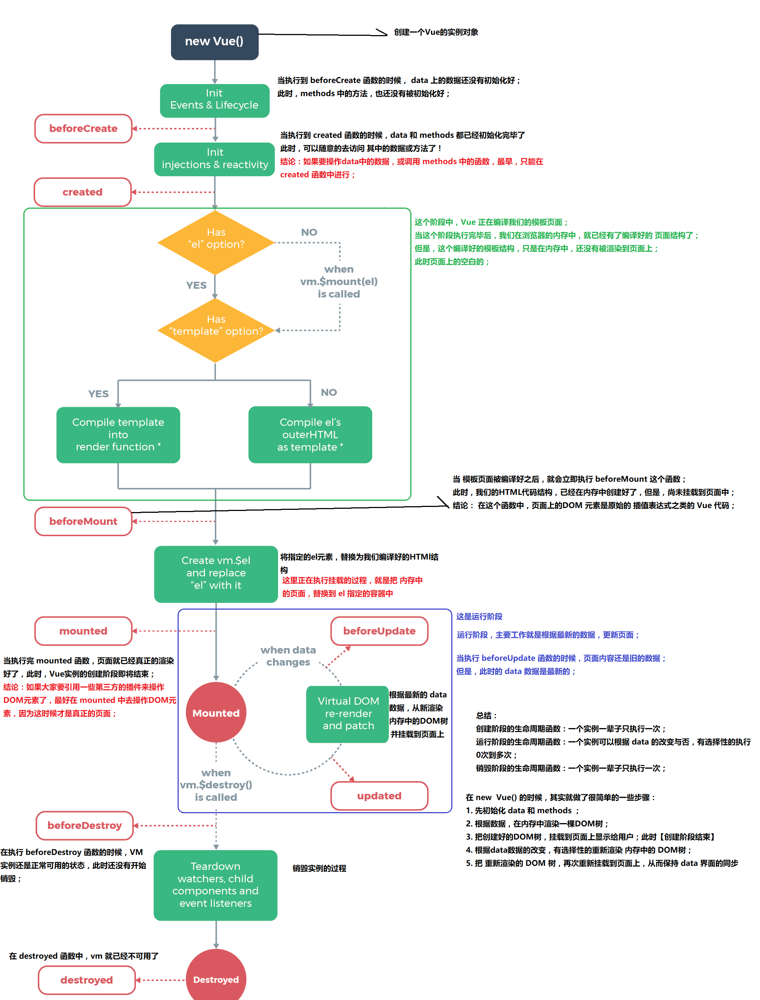

# Vue.js-Day2

## 自定义指令
> 过滤器和自定义指令函数中的this不是当前实例
```js
 // 自定义全局指令 v-focus，为绑定的元素自动获取焦点：
 Vue.directive('focus', {
   inserted: function (el) { // inserted 表示被绑定元素插入父节点时调用
     el.focus();
   }
 });

 // 自定义局部指令 v-color 和 v-font-weight，为绑定的元素设置指定的字体颜色 和 字体粗细：
   directives: {
     color: { // 为元素设置指定的字体颜色
       bind(el, binding) {
         el.style.color = binding.value;
       }
     },
     'font-weight': function (el, binding2) { // 自定义指令的简写形式，等同于定义了 bind 和 update 两个钩子函数
       el.style.fontWeight = binding2.value;
     }
   }
   ```
## 按键修饰符的使用
+ 1.通过Vue.config.keyCodes.名称 = 按键值来自定义案件修饰符的别名：
```js
Vue.config.keyCodes.f2 = 113;
```
+ 2.使用自定义的按键修饰符：
```html
<input type="text" v-model="name" @keyup.f2="add">
```
## Vue实例的生命周期

+   什么是生命周期：从Vue实例创建、运行、到销毁期间，总是伴随着各种各样的事件，这些事件，统称为生命周期！
+  生命周期钩子：就是生命周期事件的别名而已；
+  生命周期钩子 = 生命周期函数 = 生命周期事件
+   主要的生命周期函数分类：
     -   创建期间的生命周期函数：
           * beforeCreate：实例刚在内存中被创建出来，此时，还没有初始化好 data 和 methods 属性
           * created：实例已经在内存中创建OK，此时 data 和 methods 已经创建OK，此时还没有开始 编译模板
           * beforeMount：此时已经完成了模板的编译，但是还没有挂载到页面中
           * mounted：此时，已经将编译好的模板，挂载到了页面指定的容器中显示
      -  运行期间的生命周期函数：
           * beforeUpdate：状态更新之前执行此函数， 此时 data 中的状态值是最新的，但是界面上显示的 数据还是旧的，因为此时还没有开始重新渲染DOM节点
           * updated：实例更新完毕之后调用此函数，此时 data 中的状态值 和 界面上显示的数据，都已经完成了更新，界面已经被重新渲染好了！
       - 销毁期间的生命周期函数：
          *  beforeDestroy：实例销毁之前调用。在这一步，实例仍然完全可用。
         *   destroyed：Vue 实例销毁后调用。调用后，Vue 实例指示的所有东西都会解绑定，所有的事件监听器会被移除，所有的子实例也会被销毁。

## vue-resource 实现 get, post, jsonp请求
+ 1.JSONP的实现原理
- 由于浏览器的安全性限制，不允许AJAX访问 协议不同、域名不同、端口号不同的 数据接口，浏览器认为这种访问不安全；

- 可以通过动态创建script标签的形式，把script标签的src属性，指向数据接口的地址，因为script标签不存在跨域限制，这种数据获取方式，称作JSONP（注意：根据JSONP的实现原理，知晓，JSONP只支持Get请求）；

- 具体实现过程： 
*     先在客户端定义一个回调方法，预定义对数据的操作；
* 再把这个回调方法的名称，通过URL传参的形式，提交到服务器的数据接口；
* 服务器数据接口组织好要发送给客户端的数据，再拿着客户端传递过来的回调方法名称，拼接出一个调用这个方法的字符串，发送给客户端去解析执行；
* 客户端拿到服务器返回的字符串之后，当作Script脚本去解析执行，这样就能够拿到JSONP的数据了；
- 通过 Node.js ，来手动实现一个JSONP的请求例子；
```js
const http = require('http');
// 导入解析 URL 地址的核心模块
const urlModule = require('url');

const server = http.createServer();
// 监听 服务器的 request 请求事件，处理每个请求
server.on('request', (req, res) => {
 const url = req.url;

 // 解析客户端请求的URL地址
 var info = urlModule.parse(url, true);

 // 如果请求的 URL 地址是 /getjsonp ，则表示要获取JSONP类型的数据
 if (info.pathname === '/getjsonp') {
   // 获取客户端指定的回调函数的名称
   var cbName = info.query.callback;
   // 手动拼接要返回给客户端的数据对象
   var data = {
     name: 'zs',
     age: 22,
     gender: '男',
     hobby: ['吃饭', '睡觉', '运动']
   }
   // 拼接出一个方法的调用，在调用这个方法的时候，把要发送给客户端的数据，序列化为字符串，作为参数传递给这个调用的方法：
   var result = `${cbName}(${JSON.stringify(data)})`;
   // 将拼接好的方法的调用，返回给客户端去解析执行
   res.end(result);
 } else {
   res.end('404');
 }
});

server.listen(3000, () => {
 console.log('server running at http://127.0.0.1:3000');
});
```
+ 2.发送get请求：
```js
getInfo() { // get 方式获取数据
this.$http.get('要请求的url地址').then(res => {
 console.log(res.body);
})
}
```
+ 3.发送post请求：
```js
postInfo() {
var url = '要请求的url地址';
// post 方法接收三个参数：
// 参数1： 要请求的URL地址
// 参数2： 要发送的数据对象
// 参数3： 指定post提交的编码类型为 application/x-www-form-urlencoded
this.$http.post(url, { name: 'zs' }, { emulateJSON: true }).then(res => {
 console.log(res.body);
});
}
```
+ 4.发送JSONP请求获取数据：
```js
jsonpInfo() { // JSONP形式从服务器获取数据
var url = '要请求的url地址';
this.$http.jsonp(url).then(res => {
 console.log(res.body);
});
}
```
## Vue 中的动画
> [Vue动画](https://cn.vuejs.org/v2/guide/transitions.html)
>> 动画能够提高用户体验，帮助用户更好的理解页面中的功能

### 使用过渡类名
1. html结构
```html
<div id="app">
 <input type="button" value="动起来" @click="myAnimate">
 <!-- 使用 transition 将需要过渡的元素包裹起来 -->
 <transition name="fade">
   <div v-show="isshow">动画哦</div>
 </transition>
</div>
```
2. VM 实例：
```js
// 创建 Vue 实例，得到 ViewModel
var vm = new Vue({
el: '#app',
data: {
 isshow: false
},
methods: {
 myAnimate() {
   this.isshow = !this.isshow;
 }
}
});
```
3. 定义两组类样式
```css
/* 定义进入和离开时候的过渡状态 */
 .fade-enter-active,
 .fade-leave-active {
   transition: all 0.2s ease;
   position: absolute;
 }

 /* 定义进入过渡的开始状态 和 离开过渡的结束状态 */
 .fade-enter,
 .fade-leave-to {
   opacity: 0;
   transform: translateX(100px);
 }
 ```
 ### 使用第三方CSS动画库
> [使用第三方CSS动画库](https://cn.vuejs.org/v2/guide/transitions.html#自定义过渡类名)
1. 导入动画类库：
```html
<link rel="stylesheet" type="text/css" href="./lib/animate.css">
```
2. 定义 transition 及属性：
```html
<transition
 enter-active-class="fadeInRight"
 leave-active-class="fadeOutRight"
 :duration="{ enter: 500, leave: 800 }">
   <div class="animated" v-show="isshow">动画哦</div>
</transition>
```
### 使用动画钩子函数
1. 定义 transition 组件以及三个钩子函数：
```html
<div id="app">
 <input type="button" value="切换动画" @click="isshow = !isshow">
 <transition
 @before-enter="beforeEnter"
 @enter="enter"
 @after-enter="afterEnter">
   <div v-if="isshow" class="show">OK</div>
 </transition>
</div>
```
2. 定义三个 methods 钩子方法：
```js
methods: {
     beforeEnter(el) { // 动画进入之前的回调
       el.style.transform = 'translateX(500px)';
     },
     enter(el, done) { // 定义了动画的终止状态
       el.offsetWidth;
       el.style.transform = 'translateX(0px)';
       done();
     },
     afterEnter(el) { // 定义了动画完成之后的回调函数
       this.isshow = !this.isshow;
     }
   }
   ```
3. 定义动画过渡时长和样式：
```css
.show{
   transition: all 0.4s ease;
 }
 ```
 ### v-for 的列表过渡
 > [列表过渡](https://cn.vuejs.org/v2/guide/transitions.html#列表的进入和离开过渡)
 1. 定义过渡样式：
 ```css
 <style>
 .list-enter,
 .list-leave-to {
   opacity: 0;
   transform: translateY(10px);
 }

 .list-enter-active,
 .list-leave-active {
   transition: all 0.3s ease;
 }
</style>
```
2. 定义DOM结构，其中，需要使用 transition-group 组件把v-for循环的列表包裹起来：
```html
<div id="app">
 <input type="text" v-model="txt" @keyup.enter="add">

 <transition-group tag="ul" name="list">
   <li v-for="(item, i) in list" :key="i">{{item}}</li>
 </transition-group>
</div>
```
3. 定义 VM中的结构:
```js
 // 创建 Vue 实例，得到 ViewModel
 var vm = new Vue({
   el: '#app',
   data: {
     txt: '',
     list: [1, 2, 3, 4]
   },
   methods: {
     add() {
       this.list.push(this.txt);
       this.txt = '';
     }
   }
 });
 ```
 ### 列表的排序过渡
 + `<transition-group>` 组件还有一个特殊之处。不仅可以进入和离开动画，还可以改变定位。要使用这个新功能只需了解新增的 `v-move` 特性，它会在元素的改变定位的过程中应用。

 +   `v-move` 和 `v-leave-active` 结合使用，能够让列表的过渡更加平缓柔和：
 ```css
 .v-move{
transition: all 0.8s ease;
}
.v-leave-active{
position: absolute;
}
```
### todo小案例
```js
<!DOCTYPE html>
<html lang="en">
<head>
    <meta charset="UTF-8">
    <meta name="viewport" content="width=device-width, initial-scale=1.0">
    <meta http-equiv="X-UA-Compatible" content="ie=edge">
    <title>Document</title>
</head>
<body>
    <div id="app">
        
        <input type="text" v-model='name' @keydown.13='add'>
        <ul>
          <li v-for='(item,index) in ary' :key='index'>{{item}}  <button @click='del(index)'>删除</button></li>
        </ul>
    </div>
</body>
</html>
<script src="../node_modules/vue/dist/vue.js"></script>
<script>
    let t = localStorage.getItem('myary') || "[]";
    t = JSON.parse(t);
    let vm = new Vue({
        el:'#app',
        data:{
          
            ary:t
        },
        methods: {
          add(){
            this.ary.unshift(this.name)
            localStorage.setItem('myary',JSON.stringify(this.ary))
            this.name = ''
          },
          del(n){
            this.ary.splice(n,1)
            localStorage.setItem('myary',JSON.stringify(this.ary))
          }
        },
    });
</script>
```
## 京东购物车案例
```js
<!DOCTYPE html>
<html lang="en">

<head>
    <meta charset="UTF-8">
    <meta name="viewport" content="width=device-width, initial-scale=1.0">
    <meta http-equiv="X-UA-Compatible" content="ie=edge">
    <title>Document</title>
    <style>
        img{
            /* width: 50%; */
            height: 50%;
        }
        .table tr td{
            vertical-align: middle
        }
    </style>
    <link rel="stylesheet" href="https://cdn.jsdelivr.net/npm/bootstrap@3.3.7/dist/css/bootstrap.min.css">
</head>

<body>
    <div id="app">
        <h1>{{name}}</h1>
        <table class='table table-striped table-bordered text-center text-justify'>
            <thead>
                <tr>
                    <!-- th  td 兄弟 -->
                    <th>全选<input type="checkbox" v-model='checkAll'></th>
                    <th>商品</th>
                    <th></th>
                    <th></th>
                    <th>单价</th>
                    <th>数量</th>
                    <th>小计</th>
                    <th>操作</th>
                </tr>
            </thead>
            <tbody>
                <tr v-for='(item,index) in list' :key="item.id">
                    <!-- 我们要循环展示 tr -->
                    <td><input type="checkbox" v-model='item.isSelect'></td>
                    <td></td>
                    <td>{{item.title}}</td>
                    <td>{{item.desc}}</td>
                    <td>{{item.price|money}}</td>
                    <!-- 商品的属量 -->
                    <td><input type="number" min=0 v-model='item.count'></td>
                    <!-- 商品的总价 -->
                    <td>{{item.price * item.count|money}}</td>
                    <td><button type="button" class="btn btn-danger" @click='del(item,index)'>删除</button>
                    </td>
                </tr>
                <tr>
                    <td colspan='8'>
                        <button type="button" class="btn btn-danger">清空购物车</button>
                    </td>
                </tr>
                <tr>
                    <td colspan="8">
                        总价：{{total|money}}
                    </td>
                </tr>
            </tbody>
        </table>
    </div>
</body>

</html>
<script src="../../node_modules/vue/dist/vue.js"></script>
<script src="./index.js"></script>
```
```js
Vue.filter('money', function(val, n = 2) {
    return (val / 100).toFixed(2)
})
let vm = new Vue({
    el: '#app',
    data: {
        list: [],
        name: "珠峰"
    },
    created() {
        this.getData()
    },
    methods: {
        getData() {
            // 用来获取数据的
            fetch('./data.json').then(res => res.json()).then(data => {
                console.log(data)
                this.list = data;
            })
        },
        del(item, index) {
            // this.list.splice(index,1)
            this.list = this.list.filter(val => {
                return val.id !== item.id
            })
        }
    },
    computed: {
        // checkAll(){
        //   return this.list.every(item=>item.isSelect)
        // }
        checkAll: {
            get() {
                return this.list.every(item => item.isSelect)
            },
            set(val) {
                this.list.forEach(item => item.isSelect = val)
            }
        },
        total() {
            return this.list.reduce((prev, cur) => {
                if (cur.isSelect) {
                    return prev + cur.count * cur.price
                } else {
                    return prev
                }
            }, 0)
        }
    },
})
```
### data.json
```js
[{
    "pic": "https://img10.360buyimg.com/cms/s80x80_jfs/t20599/5/1848245261/259599/458bc9b5/5b39951dNfa084179.jpg",
    "title": "郎酒123",
    "desc": "颜色：红色",
    "price": 18000,
    "count": 1,
    "isSelect": false,
    "id":100
},
{
    "pic": "https://img10.360buyimg.com/cms/s80x80_jfs/t20599/5/1848245261/259599/458bc9b5/5b39951dNfa084179.jpg",
    "title": "郎酒123",
    "desc": "颜色：红色",
    "price": 18000,
    "count": 1,
    "isSelect": true,
    "id":200
    
},
{
    "pic": "https://img10.360buyimg.com/cms/s80x80_jfs/t20599/5/1848245261/259599/458bc9b5/5b39951dNfa084179.jpg",
    "title": "郎酒123",
    "desc": "颜色：红色",
    "price": 18000,
    "count": 1,
    "isSelect": true,
    "id":300
}
]
```
## nextTick原理
+ DOM的更新是一个异步操作， 优点在于 可以提升渲染的效率
+ nextTick 会等待 DOM更新完成之后 在去触发回调函数
```js
/* @flow */
/* globals MutationObserver */

import { noop } from 'shared/util'
import { handleError } from './error'
import { isIE, isIOS, isNative } from './env'

export let isUsingMicroTask = false// 是否使用微任务

const callbacks = [] // 就是一个事件池
let pending = false

function flushCallbacks () {
  // 触发 callbacks中的回调函数
  pending = false
  const copies = callbacks.slice(0) // 复制
  callbacks.length = 0 //清空
  for (let i = 0; i < copies.length; i++) {
    copies[i]()
  }
}

// Here we have async deferring wrappers using microtasks.
// In 2.5 we used (macro) tasks (in combination with microtasks).
// However, it has subtle problems when state is changed right before repaint
// (e.g. #6813, out-in transitions).
// Also, using (macro) tasks in event handler would cause some weird behaviors
// that cannot be circumvented (e.g. #7109, #7153, #7546, #7834, #8109).
// So we now use microtasks everywhere, again.
// A major drawback of this tradeoff is that there are some scenarios
// where microtasks have too high a priority and fire in between supposedly
// sequential events (e.g. #4521, #6690, which have workarounds)
// or even between bubbling of the same event (#6566).
let timerFunc

// The nextTick behavior leverages the microtask queue, which can be accessed
// via either native Promise.then or MutationObserver.
// MutationObserver has wider support, however it is seriously bugged in
// UIWebView in iOS >= 9.3.3 when triggered in touch event handlers. It
// completely stops working after triggering a few times... so, if native
// Promise is available, we will use it:
/* istanbul ignore next, $flow-disable-line */
if (typeof Promise !== 'undefined' && isNative(Promise)) {
  const p = Promise.resolve()
  timerFunc = () => {
    p.then(flushCallbacks)
    // In problematic UIWebViews, Promise.then doesn't completely break, but
    // it can get stuck in a weird state where callbacks are pushed into the
    // microtask queue but the queue isn't being flushed, until the browser
    // needs to do some other work, e.g. handle a timer. Therefore we can
    // "force" the microtask queue to be flushed by adding an empty timer.
    if (isIOS) setTimeout(noop)
  }
  isUsingMicroTask = true
} else if (!isIE && typeof MutationObserver !== 'undefined' && (
  isNative(MutationObserver) ||
  // PhantomJS and iOS 7.x
  MutationObserver.toString() === '[object MutationObserverConstructor]'
)) {
  //使用MutationObserver构造函数，新建一个实例，同时指定这个实例的回调函数；这里的回调函数类似于then 是一个微任务
  // Use MutationObserver where native Promise is not available,
  // e.g. PhantomJS, iOS7, Android 4.4
  // (#6466 MutationObserver is unreliable in IE11)
  let counter = 1
  const observer = new MutationObserver(flushCallbacks)
  const textNode = document.createTextNode(String(counter))
  observer.observe(textNode, {
    characterData: true
  })
  timerFunc = () => {
    counter = (counter + 1) % 2
    textNode.data = String(counter)
  }
  isUsingMicroTask = true
} else if (typeof setImmediate !== 'undefined' && isNative(setImmediate)) {
  // Fallback to setImmediate.
  // Technically it leverages the (macro) task queue,
  // but it is still a better choice than setTimeout.
  timerFunc = () => {
    setImmediate(flushCallbacks)
  }
} else {
  // Fallback to setTimeout.
  /* 
  两者都代表主线程完成后立即执行，其执行结果是不确定的，
  可能是setTimeout回调函数执行结果在前，也可能是setImmediate回调函数执行结果在前
  ，但setTimeout回调函数执行结果在前的概率更大些，
  这是因为他们采用的观察者不同，setTimeout采用的是类似IO观察者，setImmediate采用的是check观察者，
  

  观察者的优先级顺序是：io观察者>check观察者

  setTimeout()，精确度不高，可能有延迟执行的情况发生，且因为动用了红黑树，所以消耗资源大； 
  setImmediate()，消耗的资源小，也不会造成阻塞，但效率也是最低的。
  */
  timerFunc = () => {
    setTimeout(flushCallbacks, 0)
  }
}

export function nextTick (cb?: Function, ctx?: Object) {
  let _resolve
  callbacks.push(() => {
    if (cb) {
      try {
        cb.call(ctx)
      } catch (e) {
        handleError(e, ctx, 'nextTick')
      }
    } else if (_resolve) {
      _resolve(ctx)
    }
  })
  if (!pending) {
    pending = true // 异步函数执行完成之后 pending 又变成了 false
    timerFunc() // 它是一个异步函数； 
  }
  // $flow-disable-line
  if (!cb && typeof Promise !== 'undefined') {
    return new Promise(resolve => {
      _resolve = resolve
    })
  }
}
```
### 总结
> nextTick执行传递了一个 回调函数；nextTick源码把传进来的函数 放到了一个 callbacks数组中的，这个数据其实就是一个事件池，源码中的添加完成之后， 根据pending这个变量，执行了timerfunc且把 pending变成了  true；这样 在多次同步使用 nextTick时 就不会再去执行 timerfunc, timerfunc是一个函数 函数里 做了一个异步操作（就是让flushCallbacks异步执行），为啥异步执行是为了能侯在多次同步执行nextTick时 ，先把回调函数放到事件池中；等同步执行完成之后， 在去执行异步flushCallbacks，flushCallbacks 这个函数就是把事件池中的所有回调函数挨个执行了